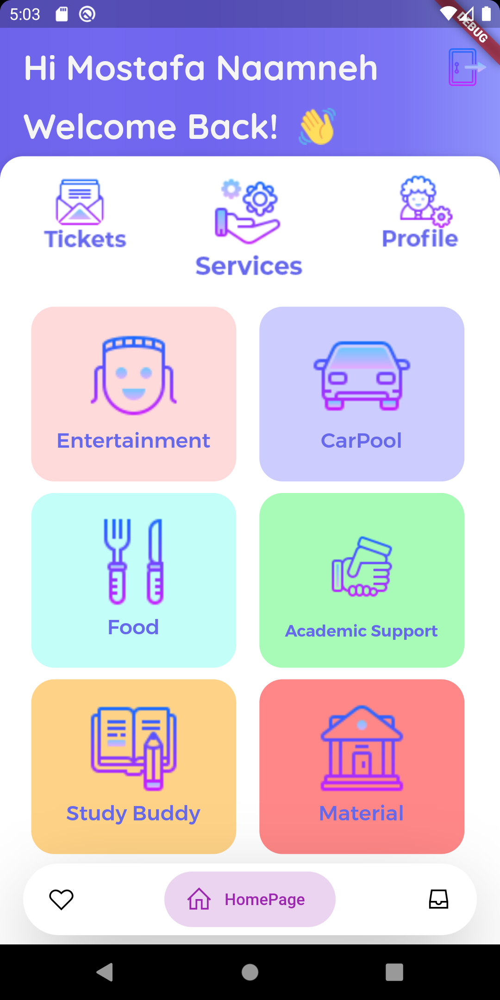
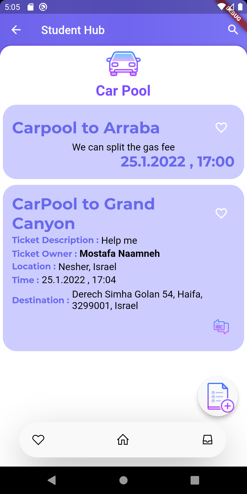
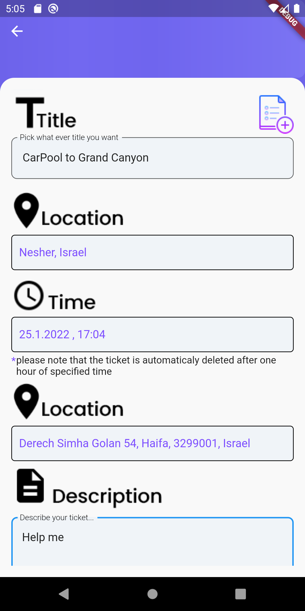
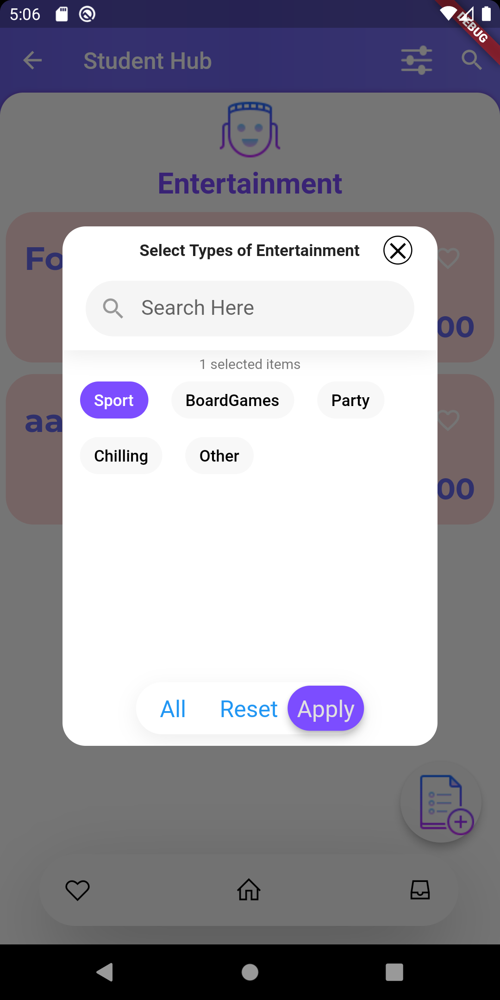
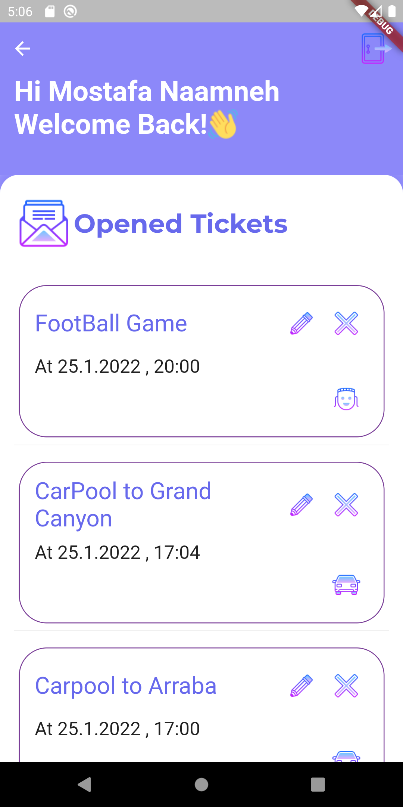
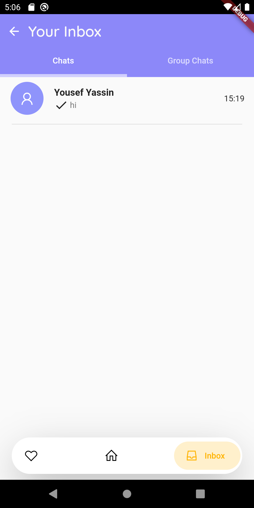

# StudentHub

An application whose goal is to provide specialised services for students that can help them academically and financially, and find several activities.

     

### Motivation

Many students have difficulty finding a study partner, academic help, a group to hang out with, or a ride to and from campus.
To solve these problems, students have to search on various platforms in order to find their need.
Our application provides essential social and academic services to solve these problems, all in one place , in that way we can improve student lifestyle in campus.

### Core Features

* View study materials shared by students.
* Find study partners.
* Find academic help from fellow students.
* Carpool to and from campus and share gas expenses.
* Find a group for a game night.
* Find someone to go out to eat or share a drink with.
* Find someone to place an order with and share delivery costs.
* Chat with the ticket owner
* Chat with the group that is particpating in a certain ticket ( Group Chat)

### Complementary features

* All users will be verified upon registration by verfecation from their Technion Email
* Event Reminder (Notifactions).
* Chat Notifcations (for recived messages).
* 'Faviorite Tickets' tab which contains upcoming events that the people loved.
* 'My Tickets' tab which contains user created tickets.
* Search bar for all types of searches.
* Filtering option for entertamient tickets.

### Table of Contents
1. [Application structure](docs/AppStructure.md)
2. [Firebase structure](docs/DataBase(FireBase).md)
3. [Setup](docs/Setup.md)

# Disclaimer

Google Play and the Google Play logo are trademarks of Google LLC.

