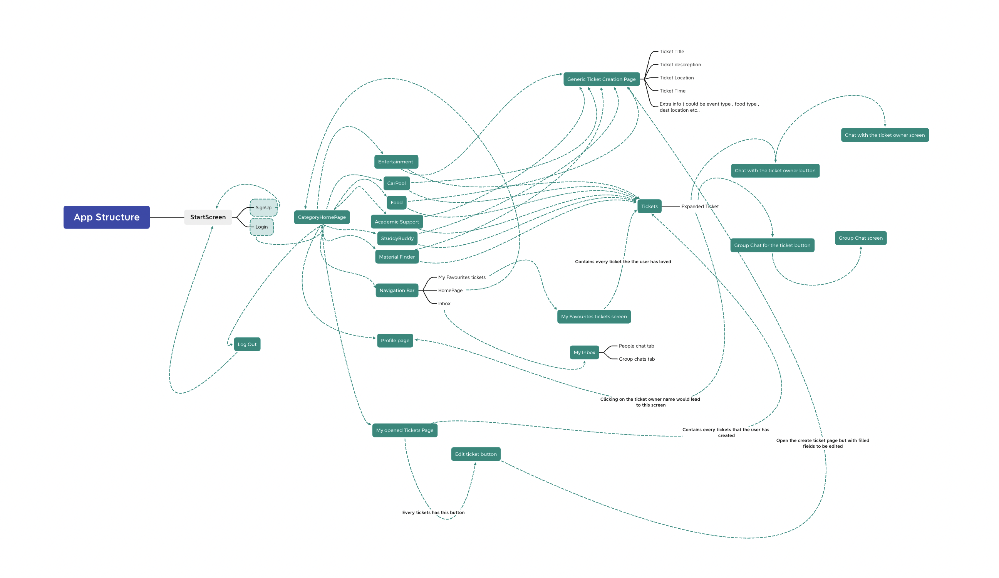

# List of screens:

## HomePage Main Screen

## SignUp Screen

## LogIn screen

## All of this screen is generic(uses visibility and inhertance classes) , which means it is the same screen but it shows the user , the required fields/icons/texts on condition from what path he came from : 
-----------------------------------------------------------------------------------------------------------
## Categories HomePage Screen

## Entirtament Categroy Screen

## CarPool Categroy Screen

## Food Categroy Screen

## AcadmicSupport Categroy Screen

## StuddyBuddy Categroy Screen

## MaterialFinder Categroy Screen

## Expanded Ticket Tab small Screen

## Generic Ticket Creation Screen (This screen Shows fields regarding the screen the user came from)

-----------------------------------------------------------------------------------------------------------

## My faviorite tickets Screen 

## My Opened tickets Screen 

## Chat with the ticket owner screen

## Chat with the event group (second sprint)

## Inbox Screen 
** People Chats Tab
** Group Chats Tab

## Profile Page Screen 

