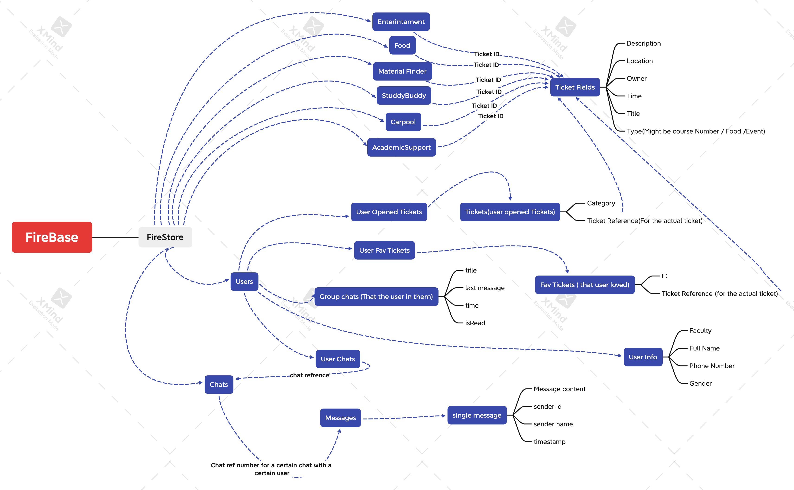

## * FireBase

## * FireStore

## * Categories

## * Enterintament

## * Food

## * Material Finder

## * StuddyBuddy

## * Carpool

## * AcademicSupport

# * Ticket Fields
* Description
*	Location
*	Owner
*	Time
*	Title
*	Type(Might be course Number / Food /Event)  

## *	UserOpenedTickets
*	Category
*	Ticket Reference(For the actual ticket)

## * Fav Ticket Structure 
* ID
* Ticket Reference (for the actual ticket)

## * Users
* Chats 
* * ref ID for chats
* favirotes 
* * ref id for ticket in favs
* groups
* * Group chats 
* * * IsRead 
* * * last message 
* * * time 
* * * title
* tickets ( contains id to the user opened tickets ticket)
* User Info 
* * User Name 
* * Faculty 
* * Gender 
* * PhoneNumber

## * chats
* Chats with users doc : 
* * Messages (contains a doc which contains ) :
* * * Message
* * * Sender ID 
* * * Sender Name
* * * TimeStamp

* group chats doc :
* * Messages (contains a doc which contains ) :
* * * Message
* * * Sender ID 
* * * Sender Name
* * * TimeStamp

