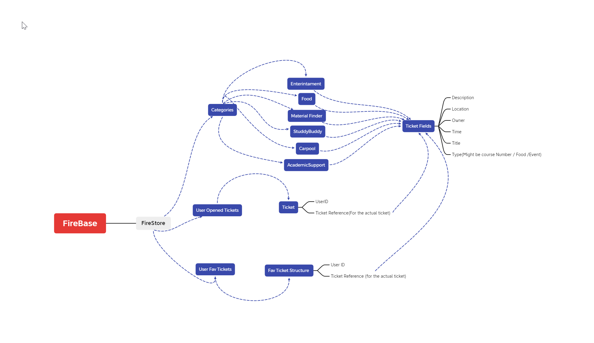

### FireBase

### * FireStore

## * User Fav Tickets

## * Categories

## * User Opened Tickets

## * Enterintament

## * Food

## * Material Finder

## * StuddyBuddy

## * Carpool

## * AcademicSupport

## * Ticket Fields
* Description
*	Location
*	Owner
*	Time
*	Title
*	Type(Might be course Number / Food /Event)  

## *	UserOpenedTickets
*	UserID
*	Ticket Reference(For the actual ticket)

## * Fav Ticket Structure 
* User ID
* Ticket Reference (for the actual ticket)
